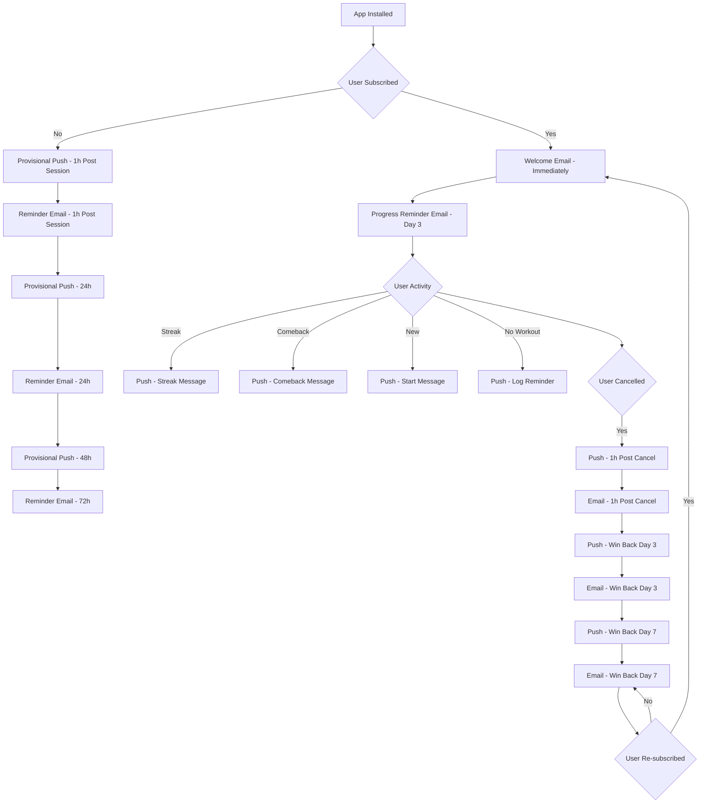

```mermaid
flowchart TD

  %% Entry Point
  A[App Installed] --> B{User Subscribed}

  %% Abandonment Path
  B -- No --> C1[Provisional Push - 1h Post Session]
  C1 --> C2[Reminder Email - 1h Post Session]
  C2 --> C3[Provisional Push - 24h]
  C3 --> C4[Reminder Email - 24h]
  C4 --> C5[Provisional Push - 48h]
  C5 --> C6[Reminder Email - 72h]

  %% Subscription Path
  B -- Yes --> D1[Welcome Email - Immediately]
  D1 --> D2[Progress Reminder Email - Day 3]

  %% Habit Loop
  D2 --> E{User Activity}
  E -- Streak --> F1[Push - Streak Message]
  E -- Comeback --> F2[Push - Comeback Message]
  E -- New --> F3[Push - Start Message]
  E -- No Workout --> F4[Push - Log Reminder]

  %% Cancellation
  E --> G{User Cancelled}
  G -- Yes --> H1[Push - 1h Post Cancel]
  H1 --> H2[Email - 1h Post Cancel]
  H2 --> H3[Push - Win Back Day 3]
  H3 --> H4[Email - Win Back Day 3]
  H4 --> H5[Push - Win Back Day 7]
  H5 --> H6[Email - Win Back Day 7]

  %% Re-subscribe possible endpoint
  H6 --> I{User Re-subscribed}
  I -- Yes --> D1
  I -- No --> H6

```
